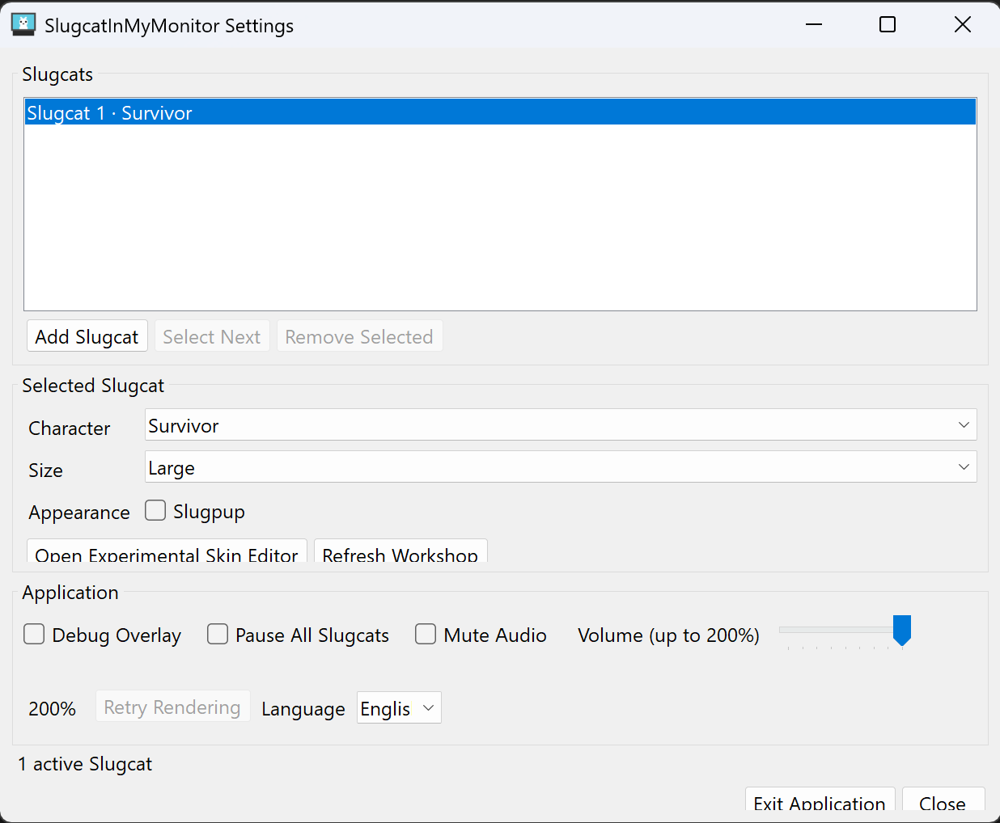
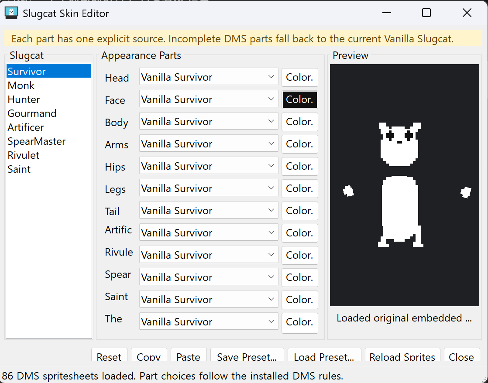

# SlugcatInMyMonitor

<p align="center">
  <a href="README.md">English</a> | <strong>한국어</strong>
</p>

<p align="center">
  
</p>

**Rain World의 슬러그캣을 Windows 바탕화면으로 데려오세요.**

SlugcatInMyMonitor는 64비트 Windows용 독립 실행형 데스크톱 펫입니다. 슬러그캣은
모니터 경계와 실제 프로그램 창을 지형처럼 이용하며, 걷기·점프·벽 오르기·휴식·마우스
관찰·다른 발판으로 이동할 시점을 스스로 선택합니다.

> [!IMPORTANT]
> **Rain World를 구매하여 PC에 설치한 사용자만 정상적으로 사용할 수 있습니다.**
> 이 프로그램은 사용자의 로컬 설치본에서 슬러그캣 원본 외형과 지원되는 사운드만
> 읽습니다. Rain World 및 커뮤니티 스킨 자산, 게임 실행 파일과 DLL은
> 저장소나 배포 파일에 포함되지 않습니다.

데스크톱 펫과 함께 Rain World, 스팀, Unity 또는 BepInEx를 실행할 필요는 없습니다.
필요한 파일은 로컬 설치본에서 읽기 전용으로 사용합니다.

## 주요 기능

- **바탕화면 지형:** 모니터 작업 영역, 화면 경계, 보이는 창의 윗면과 옆면을 바닥·발판·벽으로 사용
- **자율 행동:** 각 슬러그캣이 서로 다른 성격, 관심 대상, 휴식 주기, 이동 경로와 캐릭터별 움직임을 사용
- **직접 명령:** 슬러그캣을 우클릭하면 원작풍 원형 명령 UI가 열리며 `멈춰`, `움직여`, `날 따라와` 선택 가능
- **최대 8마리:** 슬러그캣을 개별적으로 추가·선택·크기 변경·캐릭터 변경·삭제
- **마우스 상호작용:** 슬러그캣을 집어 던지고 먹이를 옮기며, 일반 바탕화면 클릭을 방해하지 않으면서 마우스에 반응
- **먹이와 포만감:** 푸른 열매와 알벌레 알을 놓고 섭취·거절·포만감·소화 행동 관찰
- **원본 외형:** 로컬에 설치된 Rain World의 슬러그캣 외형 사용
- **선택적 모드 연동:** 설치 및 활성화된 Dress My Slugcat 스킨과 Push To Meow 울음 사용

## 명령과 조작

슬러그캣을 우클릭하면 명령 UI가 열립니다. 명령을 고르는 동안 해당 슬러그캣은
자리에서 움직이지 않습니다. 원하는 구역에 마우스를 올리고 아이콘을 왼쪽 클릭하세요.

| 아이콘 | 명령 | 동작 |
| --- | --- | --- |
| 일시 정지 막대 | **멈춰** | 현재 위치에서 이동만 멈춥니다. 눈 깜빡임, 주변 바라보기, 얼굴 움직임, 기본 자세와 사용 가능한 울음은 계속됩니다. |
| 재생 삼각형 | **움직여** | 평소의 자율 AI 행동으로 돌아갑니다. |
| 마우스를 향한 화살표 | **날 따라와** | 걷기와 높이가 다른 점프를 사용해 마우스에 접근합니다. 중간에 잠시 멈추거나 엎드리고, 다른 곳을 보거나 짧게 우회하기도 합니다. |

그 밖의 조작:

| 입력 | 동작 |
| --- | --- |
| 슬러그캣을 왼쪽 드래그 | 집어 듭니다. 마우스 이동 속도를 유지한 채 놓으면 옮기거나 던질 수 있습니다. |
| 슬러그캣 우클릭 | 해당 슬러그캣의 명령 UI를 엽니다. |
| 트레이 아이콘 왼쪽 클릭 | 설정 창을 엽니다. |
| 트레이 아이콘 오른쪽 클릭 | 빠른 설정, 캐릭터 선택, 먹이 주기와 종료 메뉴를 엽니다. |
| 먹이 선택 후 바탕화면 왼쪽 클릭 | 선택한 먹이를 놓습니다. |
| 놓인 먹이를 왼쪽 드래그 | 먹이를 옮기거나 던집니다. |

전역 키보드 단축키는 등록하지 않습니다. 오버레이의 빈 픽셀은 클릭을 통과시키므로,
슬러그캣 뒤에 있는 바탕화면과 프로그램을 평소처럼 사용할 수 있습니다.

## 요구 사항

### 필수

- **64비트 Windows 10 또는 Windows 11**
- **Microsoft .NET Framework 4.8 Runtime**
- **PC에 설치된 정품 Rain World**
  - 선택한 폴더에 `RainWorld.exe`와 `RainWorld_Data`가 있어야 합니다.
  - 원본 외형과 지원되는 사운드를 읽을 수 있도록 게임 파일이 온전해야 합니다.
- **Direct3D 11을 지원하는 그래픽 장치와 최신 드라이버**

배포판 실행에는 Visual Studio, .NET SDK, Unity, BepInEx 또는 Visual C++ 재배포
패키지가 필요하지 않습니다.

### 선택적 연동

- **More Slugcats 확장팩:** 슬러그펍 외형 선택과 확장팩 자산을 사용하는 콘텐츠에 필요합니다.
- **Dress My Slugcat(DMS):** 외부 DMS 스킨을 사용할 때만 필요합니다. Rain World의
  Remix 메뉴에서 DMS와 사용할 스킨을 활성화하고 게임을 한 번 정상 종료하세요.
- **Push To Meow:** 자동 울음과 이에 맞춘 눈감기·위쪽 시선 또는 창술가 꼬리
  애니메이션을 사용할 때만 필요합니다. 모드가 없으면 울음 전용 동작은 실행되지 않지만
  일반 얼굴과 대기 애니메이션은 계속됩니다.
- **스팀:** 창작마당에 설치된 모드를 자동으로 찾을 때만 필요합니다. 파일이 로컬에
  준비된 뒤에는 스팀을 계속 실행할 필요가 없습니다.

## 설치 및 실행

1. [GitHub Releases](https://github.com/joohyunjin09/Slugcat-In-My-Monitor/releases)에서
   최신 Windows 압축 파일을 내려받습니다.
2. 압축 파일의 **모든 파일**을 한 폴더에 풉니다.
3. `SlugcatInMyMonitor.exe`를 실행합니다.
4. Rain World를 자동으로 찾지 못하면 `RainWorld.exe`가 있는 폴더를 선택합니다.

압축을 푼 모든 파일을 실행 파일과 같은 폴더에 유지하세요. 일부 파일을 옮기거나
삭제하면 프로그램 실행 또는 화면 표시가 실패할 수 있습니다. 확인된 Rain World 경로는
`%LOCALAPPDATA%\SlugcatInMyMonitor\rain-world-path.txt`에 저장됩니다.

명령줄 옵션도 사용할 수 있습니다.

```powershell
# 대식가로 시작
.\SlugcatInMyMonitor.exe --slugcat gourmand

# 선택 가능: white, yellow, red, gourmand, artificer,
#            spearmaster, rivulet, saint

# Rain World 설치 경로 직접 지정
.\SlugcatInMyMonitor.exe `
  --rain-world "C:\Program Files (x86)\Steam\steamapps\common\Rain World"

# 진단 표시를 켠 상태로 시작
.\SlugcatInMyMonitor.exe --debug
```

## 설정



트레이 아이콘을 왼쪽 클릭하면 설정 창이 열립니다. 설정 창에서 다음 항목을 관리할 수 있습니다.

- 최대 8마리의 슬러그캣 추가·선택·삭제
- 선택한 캐릭터와 구현된 능력 세트 변경
- 작게·보통·크게 중 크기 선택
- More Slugcats 확장팩을 찾았을 때 슬러그펍 외형 적용
- 실험적 스킨 편집기 열기와 창작마당 데이터 새로 고침
- 모든 슬러그캣 일시 정지와 디버그 오버레이
- 사운드 음소거와 0%–200% 마스터 음량
- 그래픽 오류 발생 후 렌더링 재시도
- 한국어/English UI 선택(언어 변경 후 재시작 필요)

새로 설치한 환경에서는 사운드가 음소거 상태로 시작하며, 이후에는 마지막 음소거 및
음량 설정을 기억합니다.

## 스킨 편집기 (실험적)



> [!WARNING]
> 스킨 편집기는 실험적 기능입니다. UI, 프리셋 형식, 호환 범위와 결과가 이후 버전에서
> 바뀔 수 있습니다. DMS 스킨 파일은 읽지만 SlugBase 캐릭터·지역·게임플레이 코드·
> 모드 DLL은 실행하지 않습니다.

스킨 편집기에서는 Vanilla와 설치된 DMS 스킨에서 머리, 얼굴, 몸, 팔, 엉덩이, 다리,
꼬리, 기술병 얼굴 흉터, 물살이 아가미, 창술가 꼬리 무늬, 성자 승천 그래픽과 표식을
개별적으로 섞고 색상을 조정할 수 있습니다. 캐릭터 전용 구조는 해당 구조를 가진
슬러그캣에서만 표시됩니다. DMS 파츠가 불완전하면 외형이 사라지는 대신 현재 Vanilla
슬러그캣 파츠로 되돌아갑니다.

**복사/붙여넣기**로 설정을 옮기고, **프리셋 저장/불러오기**로 보관할 수 있습니다.
**초기화**는 기본 외형으로 되돌리며, 설치된 파일을 바꾼 뒤에는 **스프라이트 다시
불러오기**를 사용하세요.

DMS 스킨이 보이지 않는다면 다음을 확인하세요.

1. 프로그램이 올바른 Rain World 설치본을 찾았는지 확인합니다.
2. Dress My Slugcat과 사용할 DMS 스킨을 설치합니다.
3. Remix에서 두 모드를 활성화한 뒤 Rain World를 정상 종료합니다.
4. 설정 창에서 **Workshop 새로 고침**을 누르거나 프로그램을 다시 시작합니다.

활성화되어 있고 필요한 스프라이트가 모두 준비된 호환 DMS 스킨만 편집기에 표시됩니다.

## 지원 슬러그캣

아래 항목은 단순 색상 교체가 아니라 각각의 행동 프로필입니다. Rain World의 방,
생물, 캠페인 또는 전체 아이템 시스템이 필요한 기능은 데스크톱 환경에 맞게
각색되거나 제외됩니다.

| 슬러그캣 | 실행 이름 | 구현된 데스크톱 특징 |
| --- | --- | --- |
| 생존자 | `white` | 표준 이동과 능력 |
| 수도승 | `yellow` | 비교적 부드러운 이동 특성 |
| 사냥꾼 | `red` | 더 강하고 빠른 신체 능력 |
| 대식가 | `gourmand` | 무거운 체형 |
| 기술병 | `artificer` | 폭발 도약, 연기, 충격파와 자폭 이펙트 |
| 창술가 | `spearmaster` | 바늘 창 생성, 조준과 투척 |
| 물살이 | `rivulet` | 빠른 달리기와 더 높고 민첩한 점프 |
| 성자 | `saint` | 혀 발사·부착, 로프 움직임과 이동 |

## 사운드와 Push To Meow

프로그램은 로컬 Rain World 설치본에서 지원되는 이동·충돌·능력 사운드를 재생합니다.

Push To Meow가 설치·활성화되어 있으면 울음소리와 이에 맞는 얼굴/꼬리 애니메이션을
함께 실행합니다. 모드가 없거나 비활성화·음소거 상태이거나 호환되는 울음을 제공하지
못하면 울음 전용 애니메이션도 실행되지 않습니다.

Rain World 또는 모드의 사운드는 저장소나 배포 압축 파일에 복사하지 않습니다.

## 문제 해결

- **Rain World 설치본을 찾지 못함:** `RainWorld.exe`가 들어 있는 최상위 폴더를
  선택하거나 `--rain-world`로 경로를 지정하세요.
- **외형이 깨지거나 절차형 대체 그래픽만 표시됨:** Rain World 설치 파일의 무결성을
  확인한 뒤 프로그램을 다시 시작하세요.
- **슬러그펍 옵션을 사용할 수 없음:** More Slugcats 확장팩을 설치·활성화하고 올바른
  Rain World 설치본을 선택했는지 확인하세요.
- **DMS 스킨이 보이지 않음:** DMS와 스킨의 활성화 상태 및 호환되는 스킨 파일인지
  확인하고 창작마당 데이터를 새로 고치세요.
- **사운드가 들리지 않음:** **사운드 음소거**를 해제하고 음량을 올린 뒤 Rain World
  설치 경로를 확인하세요. 첫 실행은 기본적으로 음소거 상태입니다.
- **울음이 나오지 않음:** Push To Meow가 설치·활성화되어 있고 호환되는 울음을
  제공해야 합니다.
- **렌더링이 멈추거나 보이지 않음:** **렌더링 재시도**를 사용하고 그래픽 드라이버를
  업데이트하세요.
- **로그 확인:** `%LOCALAPPDATA%\SlugcatInMyMonitor\errors.log`와
  `%LOCALAPPDATA%\SlugcatInMyMonitor\workshop.log`를 확인하세요.

## 개발

개발 빌드에는 PowerShell 5.1 이상, Visual Studio 2022 C++ 데스크톱 빌드 도구(v143),
Windows 10/11 SDK가 필요합니다.

```powershell
.\build.ps1 -Configuration Release
```

위 명령은 프로그램을 빌드하고 전체 테스트를 실행한 뒤 결과를
`artifacts\Release`에 생성합니다.

작업 절차는 [CONTRIBUTING.ko.md](CONTRIBUTING.ko.md)를 참고하세요. 구현 세부 문서:

- [전체 구조](docs/Architecture.md)
- [행동 호환성과 소스 경계](docs/BehaviorCompatibility.ko.md)
- [창작마당 및 DMS 호환성](docs/WorkshopCompatibility.md)
- [먹이 업데이트 상세 보고서](docs/FoodUpdateReport.ko.md)

## 에셋, 라이선스 및 상표

이 저장소는 Rain World, Dress My Slugcat, Push To Meow 또는 커뮤니티 스킨·사운드
자산을 배포하지 않습니다. 사용자는 Rain World를 정당하게 소유하고 사용하는 모든
제3자 자산의 이용 조건을 따라야 합니다. 테스트 에셋의 경계는
[THIRD_PARTY_TEST_ASSETS.md](THIRD_PARTY_TEST_ASSETS.md)를 참고하세요.

이 프로젝트는 비공식 팬 프로젝트이며 Videocult 또는 Akupara Games와 제휴하거나
승인받은 프로젝트가 아닙니다. Rain World 및 관련 명칭과 자산의 권리는 각 권리자에게
있습니다. 프로젝트 코드는 [MIT License](LICENSE)로 배포되며 제3자 자산에는 해당
라이선스가 적용되지 않습니다.
