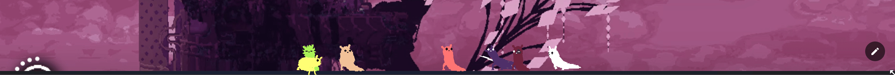
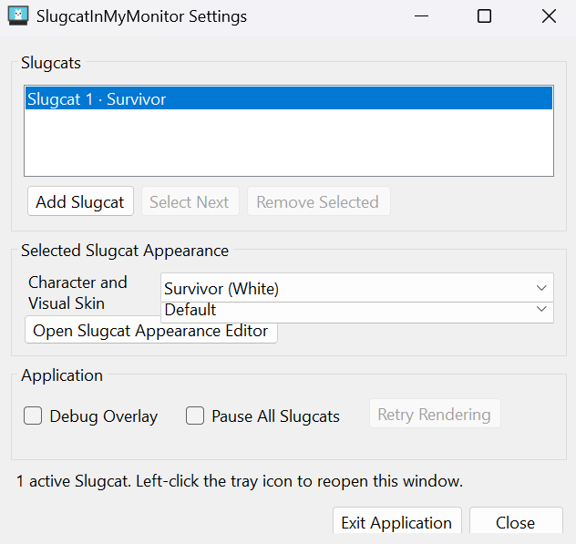
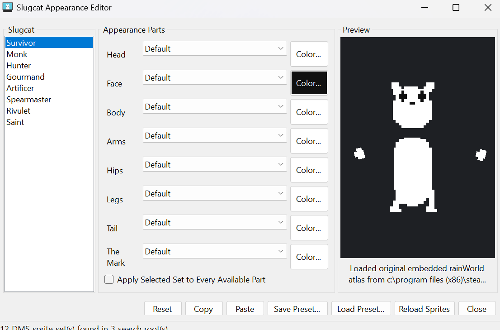

# SlugcatInMyMonitor

[](docs/media/readme/example.mp4)

미리보기를 클릭하면 원본 MP4 영상을 볼 수 있습니다.

Rain World의 Slugcat이 Windows 바탕화면을 돌아다니는 데스크톱 펫입니다.
Slugcat은 모니터와 실제 창의 경계를 바닥이나 벽처럼 이용하고, 걷기·점프·낙하·벽
오르기·휴식 같은 행동을 스스로 선택합니다. 마우스로 잡아서 옮기거나 던질 수도 있습니다.

프로그램은 로컬 Rain World 설치본에서 원작 플레이어 atlas를 실행 중에 읽습니다.
Rain World나 Steam을 함께 실행할 필요가 없으며, 게임 자산을 저장소나 배포 파일에
포함하지 않습니다.

## 지원 Slugcat

각 Slugcat은 원작에서 확인한 기본 색상과 일부 능력치 차이를 사용합니다.

| Slugcat | 실행 이름 | 기본 색상 |
|---|---|---|
| Survivor | `white` | White |
| Monk | `yellow` | Yellow |
| Hunter | `red` | Red |
| Gourmand | `gourmand` | Light brown |

Downpour가 설치되어 필요한 atlas를 찾을 수 있으면 아래 외형도 선택할 수 있습니다.
이 항목들은 현재 물리나 AI가 다른 별도 캐릭터가 아니라, 선택한 Slugcat에 적용되는
**실험적 시각 스킨**입니다.

- Artificer
- Spearmaster
- Rivulet
- Saint

## 설정 패널



시스템 트레이의 Slugcat 아이콘을 왼쪽 클릭하면 설정 패널이 열립니다.

- Slugcat 추가, 선택 및 삭제
- 캐릭터와 기본 색상 변경
- 실험적 시각 스킨 선택
- 디버그 표시와 전체 일시 정지
- 렌더링 재시도 및 프로그램 종료

시스템 단축키와 충돌하지 않도록 전역 단축키는 등록하지 않습니다. 트레이 우클릭
메뉴는 설정 창을 열 수 없을 때 사용할 수 있는 보조 경로입니다.

## 스킨 패널 (Experimental)

> [!WARNING]
> 스킨 설정 시스템은 현재 테스트 목적으로 개발 중인 임시 기능입니다.
> UI, 프리셋 형식, 지원 범위와 결과가 이후 버전에서 변경될 수 있습니다.
> 외부 및 Steam Workshop 스킨은 **Dress My Slugcat(DMS) 형식만 지원**합니다.
> SlugBase 캐릭터, 지역, 게임플레이 및 DLL 기반 Workshop 모드는 불러오지 않습니다.



스킨 패널에서는 Slugcat 외형을 미리 보면서 머리, 얼굴, 몸, 팔, 엉덩이, 다리,
꼬리와 The Mark의 스프라이트 또는 색상을 바꿀 수 있습니다. 설정을 복사하거나
프리셋 파일로 저장하고 다시 불러오는 기능도 제공합니다.

지원되는 Dress My Slugcat 형식의 스킨은 `metadata.json`과 파츠별 PNG/TXT atlas
쌍으로 구성됩니다. 프로그램은 다음 위치에서 DMS 스킨을 검색합니다.

- 실행 파일 주변의 `skins` 폴더
- 개발 저장소의 `assets/skins`
- `%LOCALAPPDATA%\SlugcatInMyMonitor\skins`
- Rain World의 로컬 mod 폴더

## 설치 및 실행

### 요구 사항

- Windows 10 또는 Windows 11
- .NET Framework 4.8
- 로컬 Rain World 설치본

[GitHub Releases](https://github.com/leesiuuuu/Slugcat-In-My-Monitor/releases)에서 최신
Windows ZIP을 내려받아 압축을 푼 뒤 `SlugcatInMyMonitor.exe`를 실행합니다. Rain World
설치 경로를 자동으로 찾지 못하면 프로그램이 폴더 선택 창을 표시합니다.

명령줄에서 캐릭터나 설치 경로를 지정할 수도 있습니다.

```powershell
# Gourmand로 실행
.\SlugcatInMyMonitor.exe --slugcat gourmand

# 선택 가능: white, yellow, red, gourmand, artificer,
#               spearmaster, rivulet, saint

# Rain World 설치 경로 직접 지정
.\SlugcatInMyMonitor.exe `
  --rain-world "C:\Program Files (x86)\Steam\steamapps\common\Rain World"
```

## 조작

- Slugcat 위에서 마우스 왼쪽 버튼: 잡기
- 잡은 채 이동한 후 놓기: 던지기
- Slugcat 클릭 또는 잡기: 설정할 Slugcat 선택
- 트레이 아이콘 왼쪽 클릭: 설정 패널 열기
- 모든 모니터 밖으로 벗어남: 약 1초 후 안전한 바닥으로 자동 복귀

## 개발

PowerShell 5.1 이상과 Visual Studio 2022 C++ 데스크톱 빌드 도구에서 Release 빌드와
전체 테스트를 실행할 수 있습니다. DirectComposition 브리지는 Windows SDK의
Direct3D 11, DXGI, DirectComposition 라이브러리를 사용합니다.

```powershell
.\build.ps1 -Configuration Release
```

일반 변경은 `feature/*` 또는 `fix/*`에서 작업해 `develop`으로 합치고, 배포할 변경은
`develop`에서 `main`으로 PR을 만듭니다. Release Drafter가 작성한 릴리즈를 게시하면
Windows ZIP과 SHA-256 파일이 자동으로 첨부됩니다. 자세한 절차는
[CONTRIBUTING.md](CONTRIBUTING.md)를 참고하세요.

구현 세부사항은 다음 문서에 분리되어 있습니다.

- [전체 구조](docs/Architecture.md)
- [원작 동작 대응표](docs/RainWorldBehaviorMap.md)
- [Slugcat 그래픽 프로필](docs/SlugcatGraphicsProfiles.md)
- [로컬 자산 조사](docs/analysis/AssetFindings.md)
- [DLL 조사](docs/analysis/DllFindings.md)
- [원작 충실도 보강 기록](docs/analysis/RainWorldFidelityOverhaul.md)

## 에셋 및 상표

이 저장소는 Rain World, Dress My Slugcat 또는 커뮤니티 스킨의 이미지와 게임 에셋을
배포하지 않습니다. 자세한 내용은 [THIRD_PARTY_TEST_ASSETS.md](THIRD_PARTY_TEST_ASSETS.md)를
참고하세요.

이 프로젝트는 비공식 팬 프로젝트이며 Videocult 또는 Akupara Games와 제휴하거나
승인받은 프로젝트가 아닙니다. Rain World 및 관련 명칭과 자산의 권리는 각 권리자에게
있습니다. 프로젝트 코드는 [MIT License](LICENSE)로 배포되며 제3자 자산에는 이
라이선스가 적용되지 않습니다.
